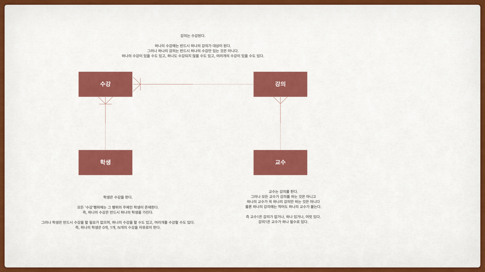
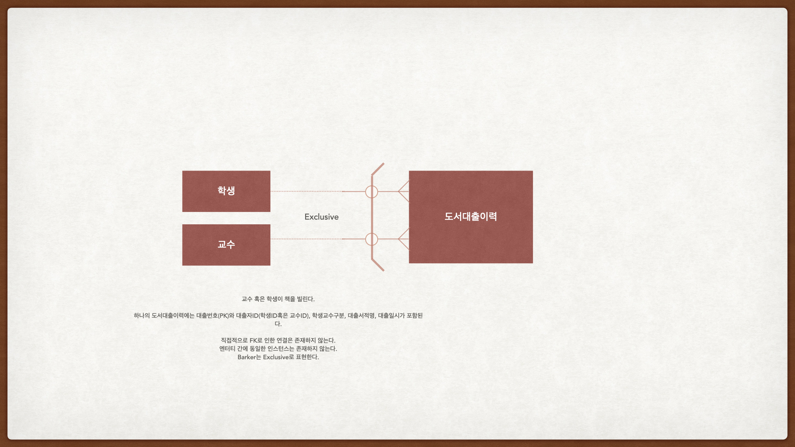

# 관계와 조인의 이해

## 개념
**관계(Relationship)** : 두 개 이상의 엔터티 간의 논리적인 연결

이를 통해 여러 데이터를 조합하여 새로운 정보를 생성할 수 있다.

실제 데이터에서 관계 표현 시 부모 엔터티 식별자를 자식 엔터티에 FK로 줘야 함. 
*[이 때 FK가 PK의 일부면 '식별 관계'. 아니면 '비식별 관계'](식별자.md#식별_관계_VS_비식별_관계)*


**조인(Join)** : 여러 엔터티에 분산된 데이터를 한 번에 통합 조회하는 SQL 기법

## 데이터 모델에서 관계 읽기

1. 관계 데이터 모델 : [IE 표기법, Barker 표기법](관계.md#관계-표기법)으로 표기




2. 계층형 데이터 모델 : 자기 자신의 엔터티와 관계를 갖는 경우.

    ERD 상으로는 한 바퀴 돌아 자기 자신과 선이 연결됨.

    ex) 메뉴(메뉴ID, 메뉴이름, 상위메뉴ID)
        
        -> 하나의 메뉴ID는 하나의 상위메뉴ID를 가질 수도 있고, 없을 수도 있다.
        (최상위 메뉴는 상위메뉴가 없고, 그 외의 메뉴는 하나씩 상위메뉴가 존재.)

        -> 하나의 상위메뉴ID는 여러개의 메뉴ID를 가질 수도 있고 없을 수도 있다.
        (각 메뉴에는 하위메뉴가 여러개일 수도 있고, 아예 없을 수도 있다.)
        

3. 상호배타적 데이터 모델 : 엔터티 간에 동일한 인스턴스가 존재하지 않도록 설계된 구조

    학생(학생id, 학생명, 주민등록번호, 성별), 교수(교수id, 교수명, 소속학과id)
    -> 도서대출이력(대출번호, 학생교수구분, 대출자id, 대출서적명, 대출일시)

    이렇게 되면 학생과 교수 뿐 아니라, 도서대출이력에도 '동일한' 인스턴스는 없다.

    IE 표기법에서 : 표현법 x.
    

    Barker 표기법에서 : exclusive 표현.

    


    이 상호배타적 데이터 모델에서 데이터를 조회하는 법
    ```
    SELECT 대출번호, 대출서적명, 대출일시
    from 도서대출이력
    where 학생교수구분 = '학생' and 대출자ID = '원하는  학생ID'
    ```

