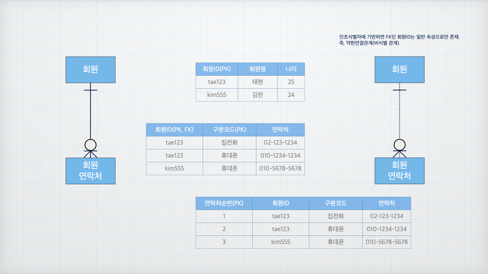

# 본질식별자 vs 인조식별자

## 정의

1. **본질식별자** : 업무에서 자연스럽게 생성되며, 고유성을 갖는 속성으로 구성된 식별자
2. **인조식별자** : 업무상 존재하지 않지만 시스템 구현이나 개발의 효율성을 위해 새롭게 생성된 식별자


> ex) [증명서발급이력](주식별자 : 발급자ID+증명서타입코드+발급일자. 일반속성 : 증명서내용) -> 본질식별자 사용.
>
> 장점 : DBMS가 자동으로 중복여부 판단. 중복 시 오류 반환.
>
> 단점 : 업무 변경에 유연한 대응이 어렵고, 구현 측면에서 관리가 복잡해질 수 있음.
>
>
> 인조식별자 '발급번호'를 추가하여 이를 주식별자로 삼으면?
>
> 장점 : 데이터 입력이 간편
>
> 단점 : 식별자가 중복되지 않아 DBMS가 중복 여부를 판단해 줄 수 없음.

*따라서 데이터를 입력하기 전에 데이터 중복 여부를 확인하는 로직을 직접 만들어야 한다.*
```
INSERT INTO 증명서발급이력 (발급번호, 발급자ID, 증명서타입코드, 발급일자)
VALUES (1, 'A001', '01', '2024-01-01');

INSERT INTO 증명서발급이력 (발급번호, 발급자ID, 증명서타입코드, 발급일자)
VALUES (2, 'A001', '01', '2024-01-01');
#후자의 인조식별자가 달라 중복 발생

SELECT COUNT(*)
FROM 증명서발급이력
WHERE 발급자ID = 'A001'
AND 증명서타입코드 = '01'
AND 발급일자 = '2024-01-01'
#이와 같이 입력 전, 사전 체크 쿼리를 발동한다.
#결과가 1이라면 조건에 해당하는 데이터가 있다는 것. 입력 불가 알림.
#결과가 0이라면 중복 데이터가 없는 것이니 데이터 입력을 진행한다.
```

### 특징

| 항목 | 본질식별자 | 인조식별자 |
|------|------|------|
| 유일성 보장 | DB가 자동으로 중복 차단 | 로직으로 중복 여부를 직접 확인해야 |
| 업무 의미 | 식별자 자체가 의미 가짐 | 단순 번호. 업무 의미 x |
| 복잡도 | 복합키(복힙식별자) 구성 시 조건 복잡 | 단순 식별자 구성. 간단 |
| 개발 편의성 | 조건 복잡. 인덱스 관리 용이 | 편리하나 인덱스 낭비. 성능 최적화 고려 필요 |
| 무결성 관리 | 구조 자체로 데이터 무결성 확보 | 어플리케이션에서 별도 처리 필요 |

## 데이터모델에서의 표현 방법

