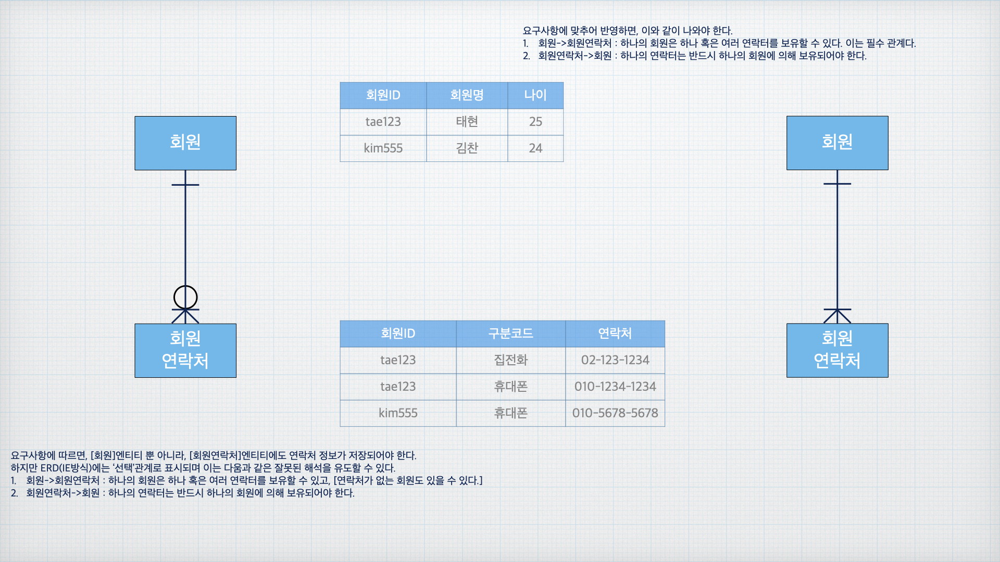

# 트랜잭선

## 정의

**트랜잭션(Transaction)** : 하나의 논리적인 업무 단위.

하나의 트랜잭션은 모두 성공하거나, 모두 실패해야 한다.(**원자성**)

ex) '송금'트랜잭션은 A의 계좌에서 돈을 빼고+B의 계좌에 돈을 넣는다. '출금'만 되고 '입금'이 안되면 문제가 됨.-> 출금도 취소(롤백)

## 모델에서 트랜잭션 개념을 포현하는 법

> **요구사항**
> - 회원가입 시 '회원명', '나이', '휴대폰번호' 필수 입력
> - 집전화번호는 선택 입력
>
> **트랜잭션으로 표현**
> 
> 1. 회원 엔터티에 회원 정보를 추가
> 2. 회원연락처 엔터티에 휴대폰 정보를 추가 
> 3. 회원가입 완료
>
> 

